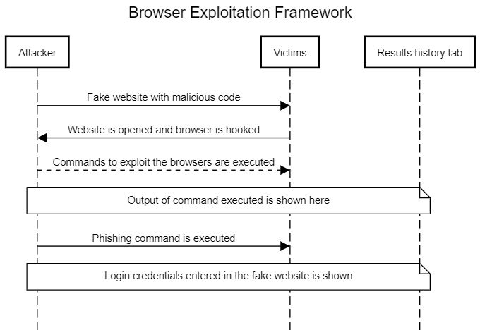
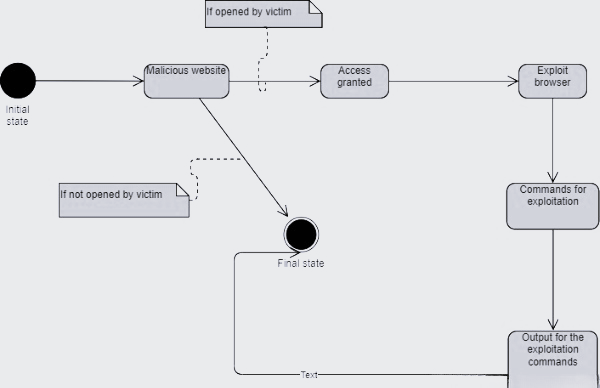
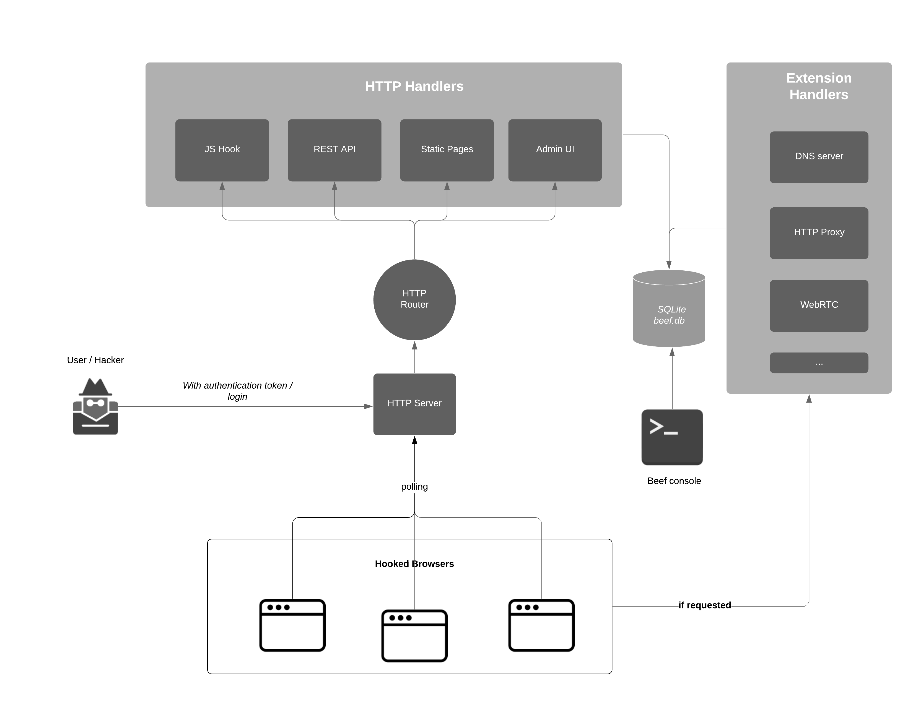

# BeEF-Tool
BeEF is short for The Browser Exploitation Framework. It is a penetration testing tool that focuses on the web browser.
This project is done using the BeEF tool to perform attacks on another user to know how they work and prevent them.
The "CNproj.docx" is the report document for the project done.
  

> IMAGES:

  

